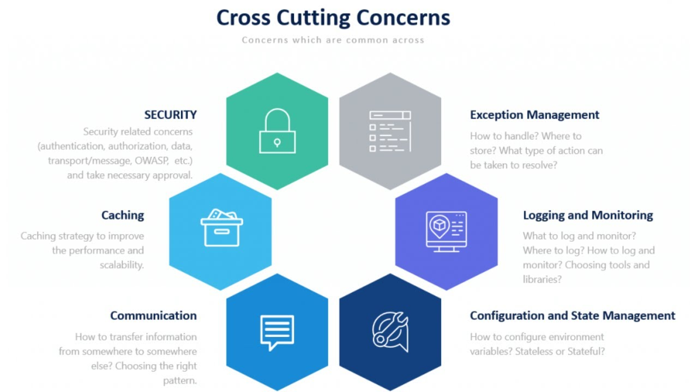

- SDK: Software Development Kit => Geliştirme için kullanılan ortam.
- Runtime: SDK ile geliştirilen uygulamaları çalıştırmamızı sağlayan ortam. Servera deploy edilirken serverda runtime kurulu olması yeterlidir.

- Önemli olan neyin nerede kullanılacağını bilmek. Örneğin Unit Testin nereye yazılmasını bilmek önemli, nasıl yazıldığını ezberlemek değil.


- Model-View-Controller(MVC) Design Pattern
Günümüzde web ve API tarafında çok yaygın kullanılır. Ancak daha modüler, performanslı ve sürdürülebilir projeler için bu patternı terk edeceğiz.

- RESTFul servisler HTTP protokolüyle çalışan bir mimari yaklaşımdır(Protokol = Kurallar bütünü). Bu sayede browser-server haberleşmesi gerçekleştirilebiliyor(ortak dil) ve web uygulamaları geliştirebiliyoruz. gRPC gibi bir mimari olsaydı browserlardan istek atılamazdı çünkü tarayıcılar bu protololü bilmiyor. REST mimarisinde AJAX üzerinden/SwaggerUI üzerinden endpointlerimize istek atıp haberleşebiliyoruz.

**Controller:** Arabulucudur, hiçbir zaman business ile ilgili bir görevi olmamalı. Request alır, Modele ya da View'e iletir ve geriye response döner. Unit testleri, integration testleri olmaz. Sadece end to end testleri vardır.

**Model:** Business ve Veritabanı ile ilgili işlemlerin yapıldığı yer.
- Repository(R) Katmanı = Data Access Layer(DAL) => DB işlemleri
- Service(S) Katmanı = Business Logic(BL) => Operasyon/metod/algoritma
Business tam manasıyla Database(repository)den aldığı ham veri üzerinde işlem yapan ve döndürendir.

**View:** HTML, CSS, JS - bu kursun içeriğine dahil değil.

### Notlar:
- dotnet new list ile hangi proje tipini oluşturabileceğimiz listelenir
- Bir mikroservis mimaride Identity API'sinde(kullanıcının login-logout işlemlerini gerçekleştirdiği) UI olabilir(Hibrit uygulama). Token authentication and authorization sırasında.
- [kurs1-mustknow](https://www.udemy.com/course/net-core-developer-bilmesi-gereken-kutuphaneler-konular/)
- [kurs2-jwt](https://www.udemy.com/course/aspnet-core-api-token-bazli-kimlik-dogrulama-jwt/)
- [kurs3-nlayer](https://www.udemy.com/course/asp-net-core-api-web-cok-katmanli-mimari-api-best-practices/)
- [kurs4-c#](https://www.udemy.com/course/csharp-bilgimi-gelistiriyorum-sorular-ve-cevaplar-ile/)

### Araştır:
- MinimalAPI ve FastEndpoint libraryler > Must learn APIs
- Bir uygulamayı hızlandırmanın en iyi yöntemlerinden birisi:
    1) **Redis**
    2) Optimize etmektir
    3) Veritabanınde **index** yapısı kurulmalı.
Her API ve web uygulaması cachelenmeye uygundur.
- Önce Kestrel daha sonra nginx server

### API'lerin günümüzdeki modern teknolojilerde geliştirilmesi elzemdir.

- Türkiye'de bir web projesi canlıya alınırken hosting firmasından 1. API için 2. Web Uygulaması için ayrı ayrı hosting alınıyor. Web uygulaması API ile haberleşir. Ayrıca tek bir VM ile istenilen sayıda uygulama dış dünyaya açılabilir.

# ASP.NET Core Web API Projesi
Authentication, authorization, logging, vs hepsi merkezde toplanır ve güvenlik tek bir elden yönetilir(Cros-cutting concern)


- Connected Services: DB'ler için hazır servisler bulunur. Azure, SQLite, PostgreSQL, MongoDB, RabbitMQ, vs.
- **Dependencies:**
    - **Analyzers**: .NET core ile roslyn derleyicisine geçildi. Yazılan kodlarda statik olarak analiz yapılabiliyor ve compiler uyarı yapıyor. Bu kurallar Analyzers'ta bulunur.
    - **Frameworks**: Paket sepeti => içerisinde birçok paket bulunuyor. Sadece console app ise .NETCore.App, API ile ilgili paketler gelince AspNetCore.App eklenir.
    - **Packages**: Projeye eklenen paketler(eski adı library). **Swagger OpenAPI Integration** => Endpointlerimizin hazır dokümentasyonunu oluşturmayı sağlar. Ortak bir kural seti oluşturur. Java, Python ve .Net için de aynı sonuç gösterilir. Projedeki Packages içindeki Swashbuckle.AspNetCore paketi tarafından UI oluşturulur. Ekiplerarası testi kolaylaştırıyor.
- **Properties:**
    - launchSettings.json: Development ortamı ile ilgili ayarları içeren dosya. .yaml dosyası olarak kullanılması daha okunaklı yapar(gelecekte geçilecek gibi duruyor). *Kestrel* sunucusu ile cross-platform, *IIS* ile sadece Windows serverlarda çalışır(eski). .NET Core ile Kestrel otomatik olarak gelir. Kubernetes, **Docker** hep Linux sunucu(bedava, güvenlik konfigürasyonları, paket desteği). https => Server-Client veri iletiminde SSL sertifikaları ile güvenliği sağlar. Canlıda 443 portunu kullanır. http'de 80 portu kullanılır(resmi olarak belirlenmiştir).

- **Controller:**
  Routing mekanizmasını yöneten classlardır. **ActionMethod** geri dönüş tipinde metodları dış dünyaya açılan ve başka uygulamalar tarafından çağrılabilen **Endpointlerimiz**'dir. API'mize istek atan her uygulamaya **client** denir. Client örnekleri: Postman, tarayıcı, mobil ekip, Angular ekibi, akıllı tv, vs.

    **FatController** => Controller'da herhangi bir Business Logic varsa söylenen böyle denir. Try-Catch, transaction, vs. bile olamaz. Controllerda sadece **Request**i kabul et ve tek satırla modele git fonksiyonu olmalıdır.
- **appsettings.json:**
    Uygulamamızın konfigüre edildiği yer. Global olarak DB bağlantı yolları, SMS bağlantı yolları, özellikle **ConnectionString**'ler burada tanımlanır. Burası da güvenli bir yer değildir ancak buraya yazılan bir ConnectionString environment değişkenlerle ezilebilir(**environment değişkenlerle=>*güvenli-> Azure Keyvault, Docker, Kubernetes***) canlı dbninkiyle yer değiştirilebilir. Bu şekilde güvenliğini sağlarız. Alt kümesinde Development, Staging ve Production tipleri olabilir. Bu onların base halidir. Ortak bir kısım varsa burada tanımla, değişen kısımları onların içine al(Örn: ConnectionStrings).
- **.http Dosyası:**
    Endpointleri hızlı bir şekilde test etmek için Visual Studio IDE'sine gelen yeni bir dosya. Development sırasında test için kullanılır. Diğer ekiplerle çalışırken yine Swagger, Postman gerekli.
- **program.cs:**
    İşletim sisteminde ayağa kalkan sunu ile etkileşime giren yerdir. Uygulamanın kalbi, nasıl bir ortamda çalışacağı ile ilgili bütün kodlar burada yazılır. Hangi DB'ye bağlanacak, hangi cache sistemine gidecek, nasıl bir konfigürasyonla ayağa kalkacak, vs. hepsi burada kontrol edilir. Önceden Startup.cs de vardı(.NET 6.0 öncesi).

## Environment
- **Production**
- **Staging(test)**
- **Development**
```
    Amaç, uygulamanın test, canlı, lokal gibi ortamlarda ayağa kaldırılarak her bir ortamda farklı bir davranış sergilemesidir. Bu sayede kodlarda değişiklik yapılmadan istediğimiz ortamda istediğimiz DB'ye bağlanabiliriz. Bunun için appsettings.**Development**.json, appsettings.**Production**.json, vb. dosyalar oluştururuz. Örneğin development ortamında demo bir DB'ye bağlanırken uygulama *Publish* edildikten sonra canlı DB'ye bağlanır.

    Bunun ayarı da launchSettings.json dosyasında set edilen "environmentVariables":{"ASPNETCORE_ENVIRONEMNT" : "Development"} ile yapılır. Production ve Staging de seçilebilir.
```
## HTTP Metod Seçimi
İstek yaparken en çok karşılaşılan 4 tip metod vardır.
Bu metodlar daha temiz endpoint isimlendirmemizi sağlar.
### 1) **Get:** Clientler sunucudan(bizden) data alacak.
### 2) **Post:** Clientler sunucuya(bize) data kaydedecek.
### 3) **Put:** Clientler sunucudaki(bizdeki) data güncelleyecek.
### 4) **Delete:** Clientler sunucudan(bizden) data silecek.
### 5) **Patch:** Kısmi update
