**Best Practice Örneği**
- Modeldeki Servis katmanında Repository katmanından alınan veriler bir ImmutableList içerisine record constructorunda deep copy yapılarak Controller katmanından Repository katmanına erişim kısıtlanır, DTO sayesinde veri iletilir. Bu sayede DB'deki veri bütünlüğü korunmuş olur ve client sidedan gelebilecek veri tehditlerine karşı korunulur. Controller'dan bu ImmutableList'i alarak istemcilere sunmak, veri bütünlüğünü korumaya yardımcı olur. İstemciler, bu liste üzerinde sadece okuma işlemleri yapabilir ve verilerin değiştirilmesi sadece uygulama içinde tanımlanan yollarla mümkün olur.
- Side effect'i olmayan metod(pure function) örneği - Functional Programming C# Vascaran Sarcar:
```cs
private decimal CalculateTax(decimal price, decimal tax) => (price * tax); // Bu sayede tax değeri her fonksiyonda tekrardan gönderilir. Statik/global değişkende oluşacak tax değişikliği metod çalışma mantığını etkilemez.
```
- Servisteki Add metodu geriye eklenen ürünün "Id"sini döndürür.
### Ödev:
1) ReadOnly List - Immutable List
2) Delegate / Event
3) Generic Method / Class


## Route Tanımlama:
- Model Binding: 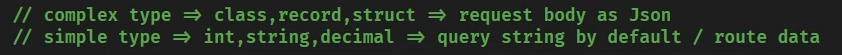
- **URL'de gizliliği önemli data taşınmamalı. Çünkü SSL dahi kullanılsa bu data şifrelenmez. Güvenli data taşıma yolu: Request/Response'ın Bodysi/Header'ı.**
- .NET'de bulunan IDataProtected() interface'indeki metodları şifreleme konusunda kullanılabilir(Tokenlarda değinilecek).

```cs
[HttpGet]
public IActionResult GetAll(int id) {...}

[HttpGet({"id"})]
public IActionResult GetById(int id) {...}

[HttpDelete]
public IActionResult Delete(int id) {...}
```

## Repository'e Update ve Add(Create) Metodlarının Eklenmesi:
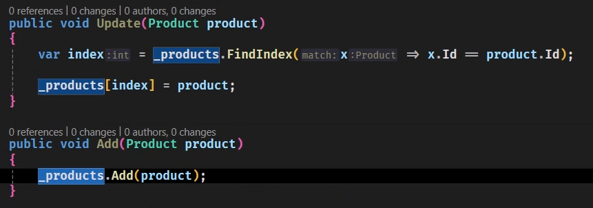

### Bu metodları karşılayabilmek için ProductRequestDto ve ProductUpdateRequest "data class/recordu" oluşturulur(sadece bize gerekli olan Name ve Price bilgisini taşımak için)

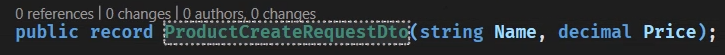


## Service'e Update ve Add(Create) Metodlarının Eklenmesi:

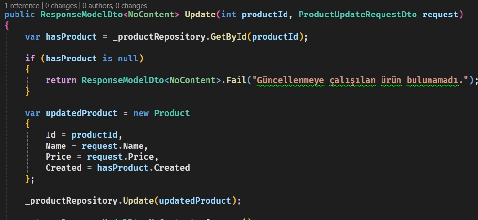
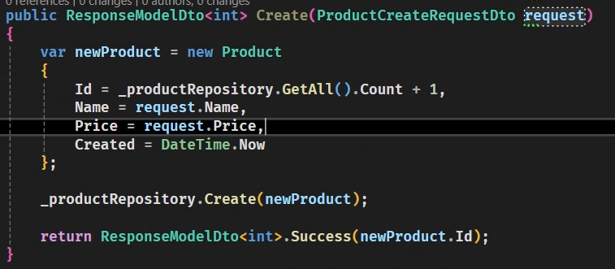

## Controller'a Update ve Add(Create) Metodlarının Eklenmesi:

### Update:
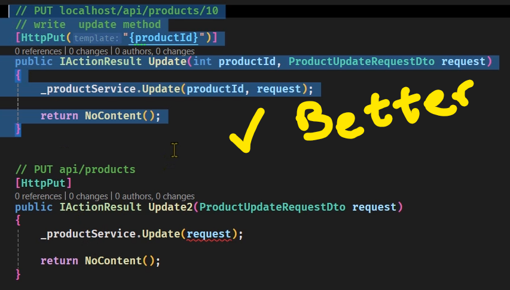

### Create:
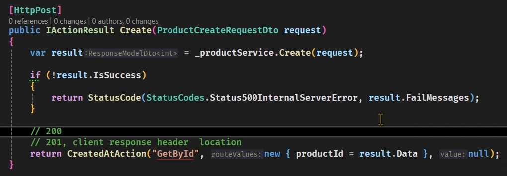
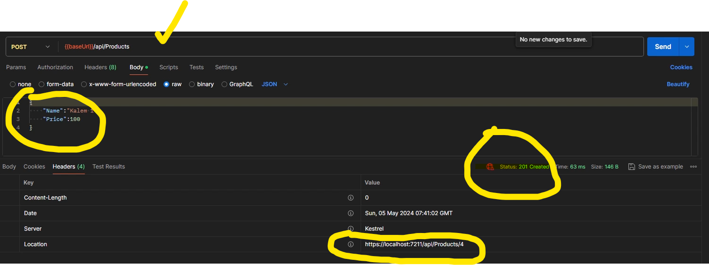


# Cyclomatic Complexity:
Bir programın karmaşıklığını ölçmek için kullanılan bir metrik veya ölçüdür. Bu ölçüm, bir programın içinde kaç tane farklı yol veya dolaşım olduğunu belirlemeye çalışır. Programlar, genellikle farklı kararlar, döngüler ve dallanmalar içerir. Cyclomatic complexity, bu yapıları analiz ederek bir programın ne kadar karmaşık olduğunu ölçmeye çalışır.

Cyclomatic complexity değeri, bir programdaki bağımsız yol sayısını belirtir. Genellikle, bu ölçüm sayesinde bir programın test edilebilirliği ve bakımı hakkında bilgi edinilebilir. Cyclomatic complexity'nin hesaplanmasında genellikle kontrol akışı grafiği kullanılır. Bu grafik, programdaki farklı kararlar, döngüler ve dallanmalar arasındaki ilişkileri görsel olarak temsil eder.

Cyclomatic complexity yüksek olan bir program, daha karmaşık ve genellikle daha fazla test gerektiren bir yapıya sahip olabilir. Bu nedenle, yazılım geliştirme sürecinde bu metriği kullanarak programların karmaşıklığını değerlendirmek ve optimize etmek önemli bir rol oynar.

In Visual Studio: [Analyze] -> [Calculate Code Metrics] -> [For Solution]

## Her route'da if() kontrolü yapmak yerine bir tane base controller oluşturup onu miras alarak bu davranışı gerçekleştirmek best practice'dir.
### **Not best practice:**

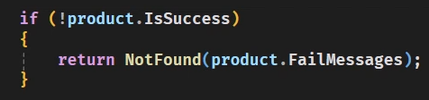

### **Response Model Edit:**
- **Kendi iç methodlarımızda kullanacağız IsSuccess gibi. O yüzden [JsonIgnore]**

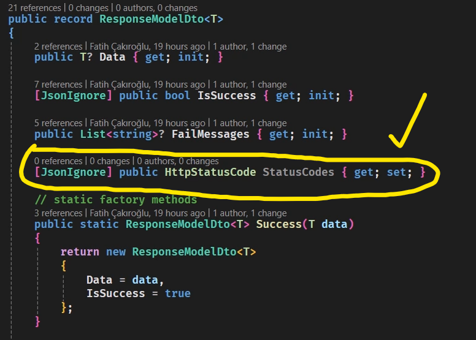

## Static Factory Methods: Success
- **Default Ok**

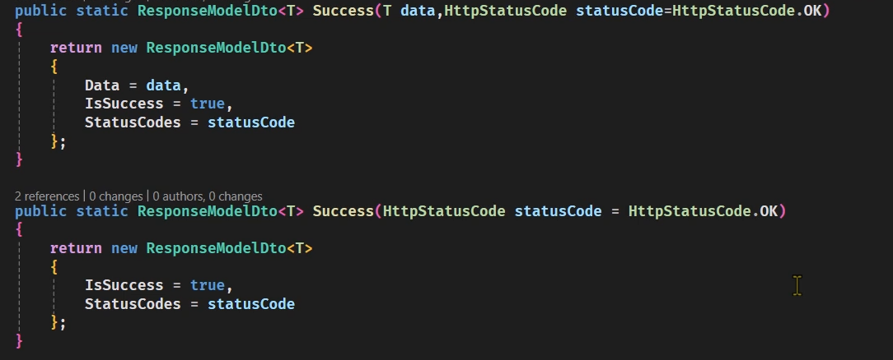

## Static Factory Methods: Fail
- **Badrequest 400 default dönmesi: Client error**

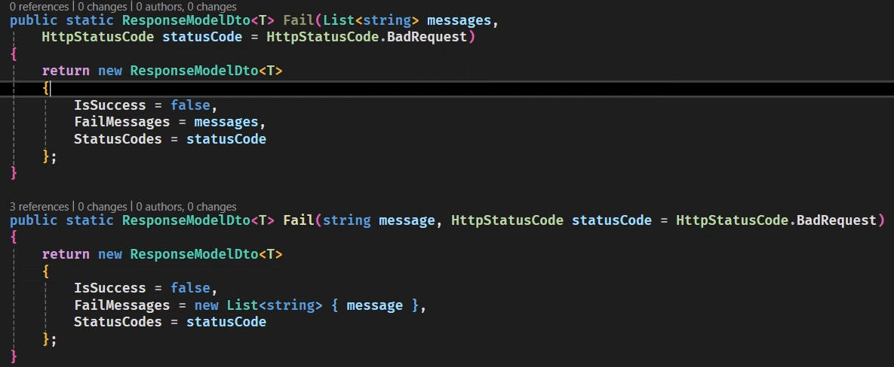

**Example: New Return Type for Create() Service method:**
- Created gönderiliyor
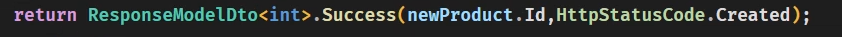

**Delete ve Update => HttpStatusCode.NoContent**

**Object => Json: Serialization**

**Json => Object: Deserialization**

# BaseController Methods:
ObjectResult içerisine ne verilirse o tipi döner. Generic bir sınıftır. Örneğin, StatusCode olarak 200 verirsek geriye 200 döner.
Aşağıdaki CreateActionResult metodu cyclomatic complexityi düşürmek için yazılmıştır. Mesaj tipine göre response tipini ya da hatalı gelmişse hata mesajını clienta gönderir.

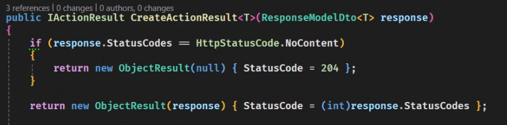

Cyclomatic Complexityi düşürmek için if sayısını azaltacağız. Bu yüzden **CreateActionResult** içerisinde data yoksa null (içindeki response'ın bodysindeki dataya karşılık gelir) ve StatusCode = 204 (no content) döner. Create dışındaki tüm metodları bu fonksiyon karşılayabilir.
- Bu sayede diğer endpointlerdeki kodumuz aşağıdaki gibi sadeleşebilir:
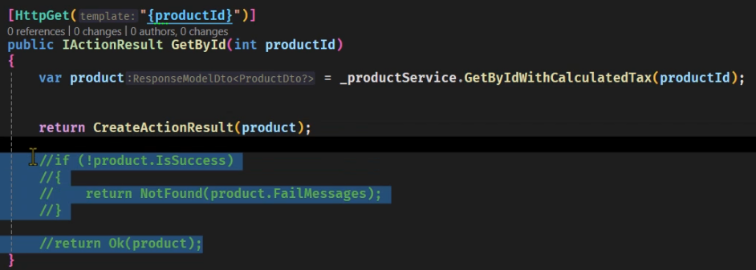
**Hatta böyle tek bir satırda lambda fonksiyonu bile olabilir:**
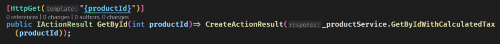

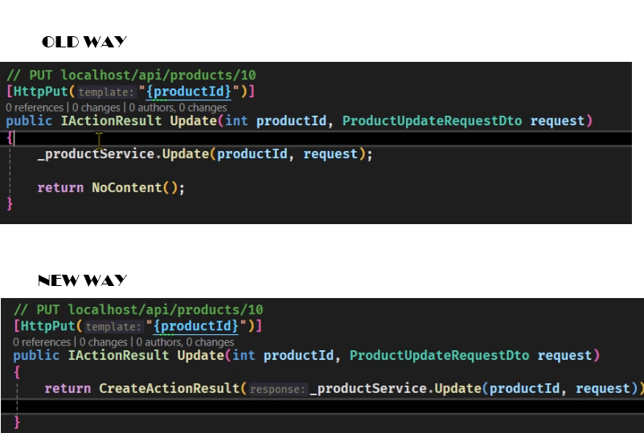

- **Controllerdaki Update endpointlerini sadeleştirmek için aşağıdaki gibi basecontroller içerisinde bir CreateActionResult overloadı yazılması gerekir.**
Response'ın headerında oluşturulan dataya erişmek ile ilgili bir data taşınabilir. 201 dışındaki hiçbir durumda bu geçerli değildir. Örneğin; Headers -> Location'da Id bulunabilir.
methodName: "Controller adı", routeValues: "Route'da taşınan değer", response: "Body içindeki mesaj".
- **CustomBaseController'da:**

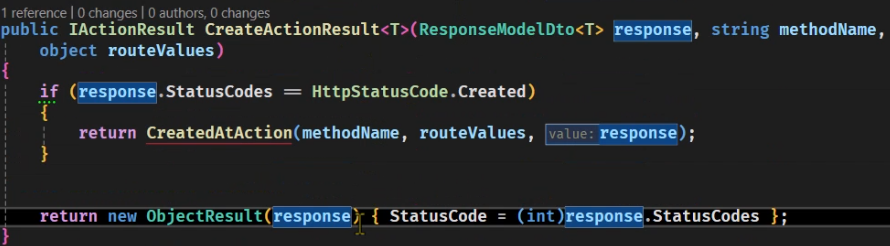
- **Onu inherit eden Controllerımızda:**

    nameof(GetId) dendiği zaman GetId metodunu çağırır.✅

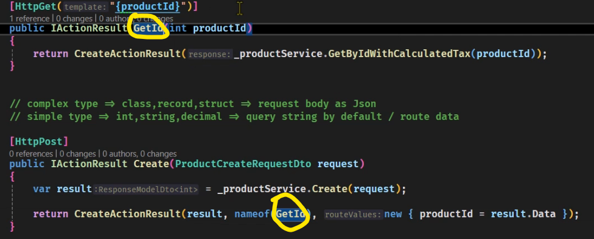