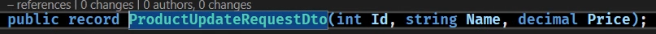
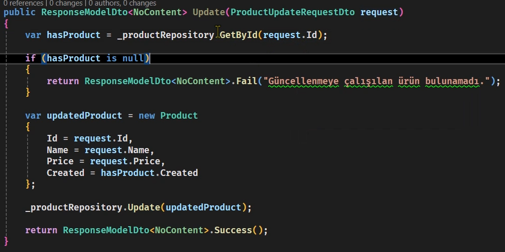

**Best Practice Örneği**
- Modeldeki Servis katmanında Repository katmanından alınan veriler bir ImmutableList içerisine record constructorunda deep copy yapılarak Controller katmanından Repository katmanına erişim kısıtlanır, DTO sayesinde veri iletilir. Bu sayede DB'deki veri bütünlüğü korunmuş olur ve client sidedan gelebilecek veri tehditlerine karşı korunulur. Controller'dan bu ImmutableList'i alarak istemcilere sunmak, veri bütünlüğünü korumaya yardımcı olur. İstemciler, bu liste üzerinde sadece okuma işlemleri yapabilir ve verilerin değiştirilmesi sadece uygulama içinde tanımlanan yollarla mümkün olur.
- Side effect'i olmayan metod(pure function) örneği - Functional Programming C# Vascaran Sarcar:
```cs
private decimal CalculateTax(decimal price, decimal tax) => (price * tax); // Bu sayede tax değeri her fonksiyonda tekrardan gönderilir. Statik/global değişkende oluşacak tax değişikliği metod çalışma mantığını etkilemez.
```
- Servisteki Add metodu geriye eklenen ürünün "Id"sini döndürür.
### Ödev:
1) ReadOnly List - Immutable List
2) Delegate / Event
3) Generic Method / Class


## Route Tanımlama:
```cs
[HttpGet]
public IActionResult GetAll(int id) {...}

[HttpGet({"id"})]
public IActionResult GetById(int id) {...}

[HttpDelete]
public IActionResult Delete(int id) {...}
```

## Repository'e Update ve Add Metodlarının Eklenmesi:


### Bu metodları karşılayabilmek için ProductRequestDto ve ProductUpdateRequest "data class/recordu" oluşturulur(sadece bize gerekli olan Name ve Price bilgisini taşımak için)




## Service'e Update ve Add Metodlarının Eklenmesi:

