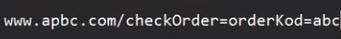
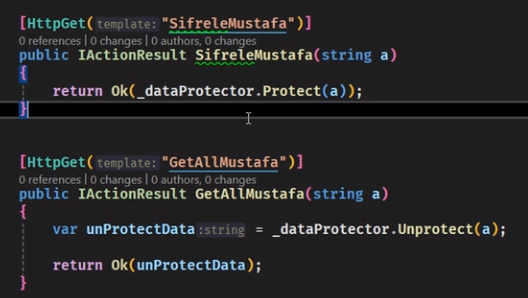
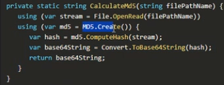

[Github Repo:](https://github.com/Fcakiroglu16/NetBootcamp.git) Branch lesson/3day

[Routing Constraints](https://learn.microsoft.com/en-us/aspnet/core/fundamentals/routing?view=aspnetcore-8.0)

[Model Validation](https://learn.microsoft.com/en-us/aspnet/core/mvc/models/validation?view=aspnetcore-8.0)
NOT:
```cs
    public record ProductCreateRequestDto([Required]string Name, decimal Price);
```
**Önemli Not:** String gibi referans tipli değişkenler için [Required] keywordü kullanılabilir ancak decimal value type bir değişkendir, default değer atar. Bunu aşmak için decimal? yapıp **nullable** hale getirmemiz gerekir. Ya da Range validation ile değer beklemeliyiz.
```cs
    /// 1. Required
    public record ProductCreateRequestDto([Required]string Name, [Required] decimal? Price);
    /// 2. Range
    public record ProductCreateRequestDto([Required]string Name, [Range(1,Int32.MaxValue)] decimal Price);
    /// 3. ErrorMessage
    public record ProductCreateRequestDto([Required(ErrorMessage = "Ürün adı bulunamadı.")]string Name, [Required] decimal? Price);
```


### Entitylerde asla UI validasyonu yapılmayacak! DTO'lar için yazılabilir(basit controllerlar için)

- Fast fail and Guard Clauses => önce olumsuz kısmı if ile kontrol et sonrasında doğru kısma geç işlemlere devam et.

### FluentValidation => .NET ile ilgili tüm projelerde kullanılmalı.
```cs
RuleFor(x=>x.Price).InclusiveBetween(1,1000).WithMessage("Fiyat 1 ile 1000 arasında olabilir");
```

```cs
RuleFor(x=>x.IdentityNo).Length(11).WithMessage("TC no 11 haneli olmalıdır").Must(CheckIdentityNo).WithMessage("TC numarası hatalıdır");

### Delegates
- Action => void
- Predicate => bool
- Func => dynamic

public bool CheckIdentityNo(string idedntityNo)
{
    /// ......

    return true;
}
```

### Not: Basit validationlar için FluentValidation kullanabiliriz. Karmaşık işlemler için servislerin içinde validation yapabiliriz.

### Tüm .NET Winforms ve WPF gibi projelerinde DIContainer olarak **Autofac** kullan 3rd party kütüphane.

### ADO.NET(old) => **EF Core** 👍
EF Core, Uygulamaları veritabanından bağımsız hale getirir.
```cs
protected override void OnConfiguring(DbContextOptionsBuilder optionsBuilder)
{
    if (!optionsBuilder.IsConfigured)
    {
        optionsBuilder.UseSqlServer("Server=(localdb)\\mssqllocaldb;Database=SchoolDB;Trusted_Connection=True;");
    }
}
// OnConfiguring method is used to configure the database provider (e.g., SQL Server, SQLite, PostgreSQL) that EF Core will use to connect to your database. This method is also typically overridden in your DbContext class and is called by EF Core when the context is being configured.
```
```cs
protected override void OnModelCreating(ModelBuilder modelBuilder)
{
    modelBuilder.Entity<Student>()
        .HasKey(s => s.StudentId);

    modelBuilder.Entity<Student>()
        .Property(s => s.Name)
        .IsRequired();

    modelBuilder.Entity<Course>()
        .HasMany(c => c.Students)
        .WithMany(s => s.Courses)
        .UsingEntity(j => j.ToTable("StudentCourse"));
}
// OnModelCreating method is used to configure the model that EF Core will use to create the database schema. This method is typically overridden in your DbContext class to define the shape of your database entities, their relationships, and various constraints.
```

EF Core tools nuget paketi yüklendikten sonra

- add-migration [migration-name]
- update-database

ile entitymiz MSSQL'e yükleniyor.


Yapılan her değişiklik için migration eklenir. Up() ve Down() metodları otomatik oluşur. Yüklerken Up() çalışır, geri almak için Down() çalışır.

remove-migration // En son migrationu siler(veritabanına yansımamış olanı)

update-database [migration-name]  yapılarak initial migrationa kadar dönüş yapılabilir. Bu sayede yapılan değişiklikler geri alınabilir/tam tersi de geçerlidir.

add-migration check // Örnek migration ismi "check"=> Eğer Up() ve Down() boşsa DB ile senkronuz demektir. Bu şekilde kontrol edebilirsin.

### **Dapper** for mini ORM 👍
Dapper, ham SQL cümleciğinden aldığı nesneyi otomatik olarak bizim classlarımıza mapler. Performanslıdır, join'in çok olduğu yerde kullanılabilir(EF Core memory kullanarak bunu yapar daha yavaştır). Bu yüzden hızın önemli olduğu yerde Dapper kullanılmalı.


### Not: **Strategy Design Pattern:** Runtime'da algoritma değişebilen design pattern. **Örn:** Üyelere hızlı video indirme seçeneği, diğerlerine yavaş.

### Not: Endpoint with Guid

Kullanıcıya sipariş no olarak guid gönder-(uniqueliği sağlar) ancak ikinci bir sütunda id değerini tut ve kendi iç metodlarında kullan.

### Not:  URL'de basic Şifreleme


### Time Limited Encryption with Encoding/Decoding(don't include / . <>  for URL encoding)
```cs
[HttpGet("SifreleMustafa")]
public IActionResult SifreleMustafa(string a)
{
    var dataProtected = _dataProtector.ToTimeLimitedDataProtector();


    return Ok(Base64UrlEncoder.Encode(dataProtected.Protect(a, TimeSpan.FromSeconds(30))));
    // return Ok(_dataProtector.Protect(a));
}

[HttpGet("GetAllMustafa")]
public IActionResult GetAllMustafa(string a)
{
    var decode = Base64UrlEncoder.Decode(a);

    // var unProtectData = _dataProtector.Unprotect(a);
    var dataProtected = _dataProtector.ToTimeLimitedDataProtector();


    return Ok(dataProtected.Unprotect(decode));
}
```
### Primary key ile veri arayan DB: ElasticSearch - tüm sütun alanları indexlenir, kibana ile görselleştirilir => hocanın udemy dersini izle

### Bir kullanıcının girişine ve yaptığı işleme ait log üretildiğinde logu md5 algoritmasına sok, hashini al ve daha sonra ilerde kontrol için kullanabilirsin.

