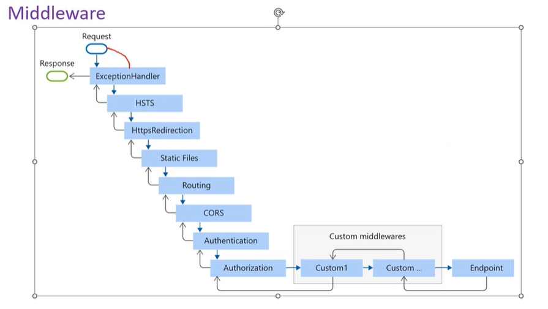
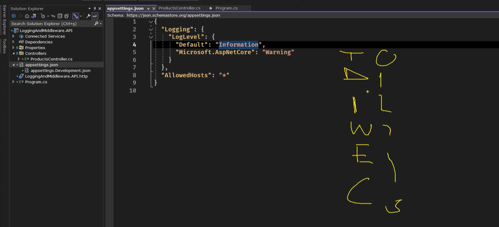
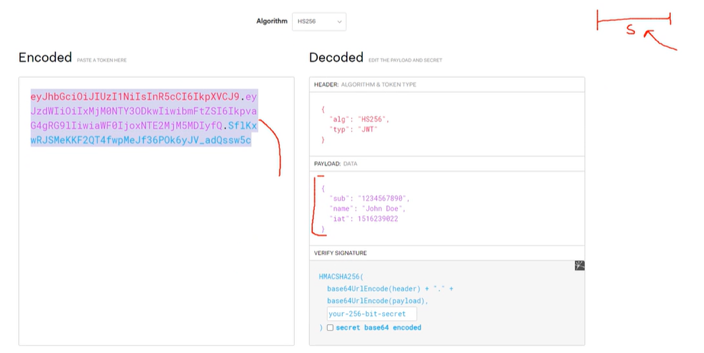

# Middlewares

Her request geldiğinde ve her responsea dönüşürken arada çalışan processler. Hepsinin adı **"Use"** ile başlar

**Filterlardan farkı:**
- Filterlar controller'daki metodlarda çalışır, Middleware'ler her requestte çalışır.
- Filterlar endpointlerdeki metodlarda çalışır, Middleware'ler endpointe gelmeden/geldikten sonra çalışabilir.
- Bir requestin response'a dönme süresini middlewareler ile bulunabilir. Filterlar bazı businesslerde çalışan bazı businesslerda çalışmayan metodlar için kullanılır.

- UseExceptionHandler: Request response'a dönmeden hemen önce - Middleware stack'in en başına konur ki DTO'lar düzgünce gönderilebilsin.
- HSTS: UI ile ilgili middleware
- UseHttpsRedirection: http ile gele istekleri https'e çevirir.
- UseAuthorization: Filterlar ile aktif hale gelir [Authorize] attribute'u ile devreye girer.

## **Logging Levels:**
1) Trace
2) Debug
3) Information
4) Warning
5) Error - methodlara özgü
6) Critical - uygulamaya özgü system down(db size full, memory full)

**Serilog(NLog'dan daha iyi):**
Tüm logları(bilinçli atılan ve sistemin attığı) DB'ye kaydederler. Singleton olarak yaşam döngüleri vardır.

Global Exception Handler Middleware:
(Swagger'dan hemen sonra)

Todo: ...

## Ödev: Exception logları Serilogtan DB'ye gönderme.

# Authorization
Token cliente dönülecek, DB'ye eklenecek ve her requestte requestin headerına konulup geri gönderilebilecek.
Json Web Token(JWT) sayesinde DB kullanmadan bu işlem yapılabiliyor.

**Web uygulamaları cookie ile API'ler token ile korunur.**
## **JWT: HEADer + Payload + Signature**
JWT imzalanabilen ve içine data konabilen bir tokendır.

JWT'de Data içine key-value pair data konabilir ancak TCKN, şifre, e-kod gibi gizli şeyler konmamalıdır. Çünkü bu veriler görülebilir ancak değiştirilemez. Çünkü sadece Base64 ile encode ediliyor. Aradaki **<script.<.....>>** gibi zararlı ifadeleri engellemek için kullanılır.

## Token ile ilgili her problemde 401 Unauthorized dönülür.
## Token'da yetki yoksa 403 Forbidden dönülür.

**Asimetrik:** Tokenlar public key(doğrula) ve private key(imzala) RSA algoritması ile oluşturulur. Dışardan gelenler doğrulanır, gönderilen imzalanır.

**Access Token:** Süresi sınırlıdır. Access süresi bittiyse refresh token ile birlikte yeni bir access token oluşturulabilir. Bu arkada süren anlık bir süreçtir.
Kötü niyetli insan bu tokenları transaction sırasında çalamaz ancak clientside'dan çaldırmış olabilir. IP adresi ve tarayıcı-lokasyon ile birlikte güvenlik önlemi sağlayabiliriz. Ayrıca kullanıcı isteklerinde anomalilik varsa cloudda gateway üzerinde AI ile kullanıcının eski tip isteklerine bakılarak güvenlik önlemini arttırabiliriz(ücretli).

**Refresh Token:** Random değer ile oluşan değeri DB'de durur ve access tokenı yeniden oluşturmamızı sağlar. Bu sayede kullanıcıyı uzun süreler authorized tutmayı sağlayabiliriz.