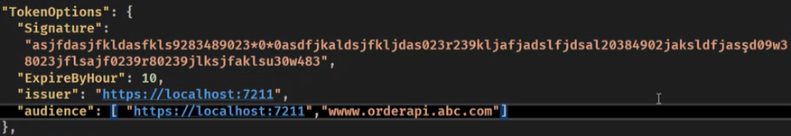
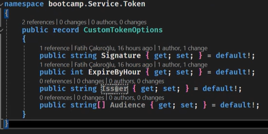
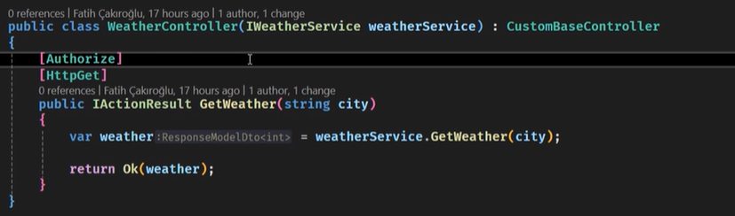
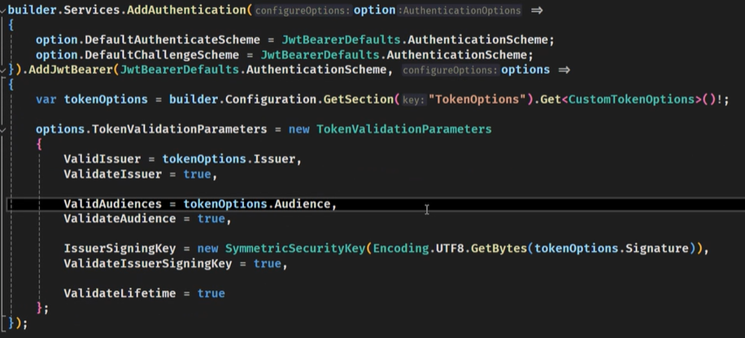
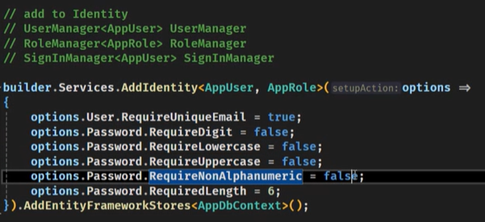
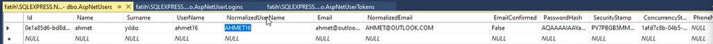

Bir tokenı doğrulamak için kontrol edilmesi gerekenler(best practice):
1) Signature*
2) Expire*
3) Audience(Mikroservislerde): Bir tokenın hangi mikroservislere istek yapacağı bilgisi vardır, array olarak tutar.
4) Issuer(tokenı kim dağıttı) Örn: www.api.com. Güvenliği arttıran bir parametre. Araya başka bir proxy girip ve onun token üretmesini engeller.

Bizde dış issue parametresi yok. Audience da kendimiziz.

**OAuth 2.0** ve **Openid connect** protokolleriyle internetteki tokenların authorization ve authentication işlemleri gerçekleştirilir. Dokümantasyonu internette.

## Not: Claimler token'ın payloadındaki key value pairlerdir.

Kullanıcı tipine göre farklı tipte token dönülür. Bu tokenları şemalar ile ayırırız. Endpointlere [Authorize("şema_adı")] attribute'ı eklenip şema belirtilerek bu işlem gerçekleştirilebilir.
Şemalarda default şema tanımlanarak sadece [Authorize] diyebiliriz

Program.cs içerisindeki AddAuthentication Servisi:

Ayrıca Program.cs içerisine app.UseAuthentication Middleware'i eklenmelidir.

## Not: Tokensız endpoint olmamalıdır.

## Not: Tokenlar server-side uygulama(mvc, nodejs, etc sayfanın yenilenebildiği) yerlerde cookie, single page ise localstorage'da tutulur.

## Microsoft'un IdentityAPI'si ile temel üyelik sistemi inşa edilebilir.
İçerisinde hazır olarak birçok servis bulunan kolay ve komple bir üyelik sistemi oluşturulabilir. Nuget -> Microsoft.AspNetCore.Identity.EntityFrameworkCore.
Daha sonra User ve Role tablosuna karşılık gelecek entityler oluşturulur, IdentityUser ev IdentityRole'den miras alınır ve DbContextimiz'de IdentityDbContext'ten miras alınarak bu entityler parametre olarak geçilir. Daha sonra program.cs içindeki servislerde user tanımlama:

RoleClaim: Permission için geçerli.

Örn: EditorRole
- add, update, remove, ... persmissions

UserClaim: Kullanıcı ?

UserClaim: Role permission ile userı eşleştirir.

UserToken: Her userın tokenı ?

UserLogins: Otomatik dolar. LoginProvider, ProviderKey, ProviderDisplayName ve UserId sütunları bulunur.

Şifreler her zaman tek yönlü algoritmalar ile hashlenir ve dbye öyle kaydedilir.
Tek yönlü => Geriye dönülemez.
Her şifre geldiğinde tekrardan hashleyip dbdeki ile karşılaştırma yapılır. Hiçbir zaman şifreyi çözüp geri elde edemeyiz(md5 sha256, sha512 örnek algoritmalar).

## **Not:** Metodları yazarken her zaman Fail-fast, guard clause yöntemini kullan.

## **Not:** Index tabloları önemli => NonClusteredIndex: Where komutu kullanılan yerlerde buna geç aşırı performans artışı sağlanır.

## **Not:** Azure ApplicationInsight özelliği - ya da Opentelemetry ya da Kubernetes gibi toollar requestin response'a dönmesine bakarak optimizasyon işlemlerini gerçekleştirebilriiz.

## **Not:** Sistem yüke binmiyorsa asenkron koda geçmeye gerek yoktur.

**Not:**
0 55
55534
555 444
...
 telefon numarası numaraları için yeni bir sütun oluştur ve düzgün verileri buraya al => tablo oluşturma maliyetiyle hızı arttırırız. O da olmazsa cachelenebilir datalar.