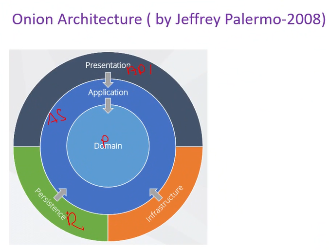
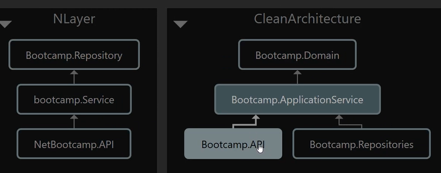

1) Katmanlı Mimari
Top level: API/UI/Desktop
Mid level: Business logic
Bot level: Infrastructure logic

Problem:
- Servis katmanı DB'yi/ORM'yi/Cachingi/Datanın nereden geldiğini bilmemeli. IRepository üzerinden erişmeli.
- Bu mimaride DbContect'e servis katmanından erişim sağlanabilir.
- IProductRepository yerine ProductRepository'e de erişebilir.

Aşağıdaki 3 mimari bu problemleri farklı zamanda aynı şekilde çözmeye çalışmıştır.
Clean architecture - Kitabı olan en güncel mimari(2017)
Onion architecture(2008)
Hexagonal architecture(2005)

Presentation = API = en üstte
Repository - Persistence en üstte. AppDbContext burada
ApplicationService = Business Logic ortada => Uygulamanın kalbi ancak datanın nereden geldiğini bilmiyor ve datanın nereye kaydedileceğini bilmiyor.
Domain en altta = Entityler burada olacak

Session best practice değildir. Cache kullanacağız. Cache ömür boyu aktif kalabilir.
Sessionda kullanıcıya özgü data tutulabilir, cache'de bu özellik yoktur. Cahce'de çok sık erişilen ancak çok sık güncellenmeyen veriler tutulur.